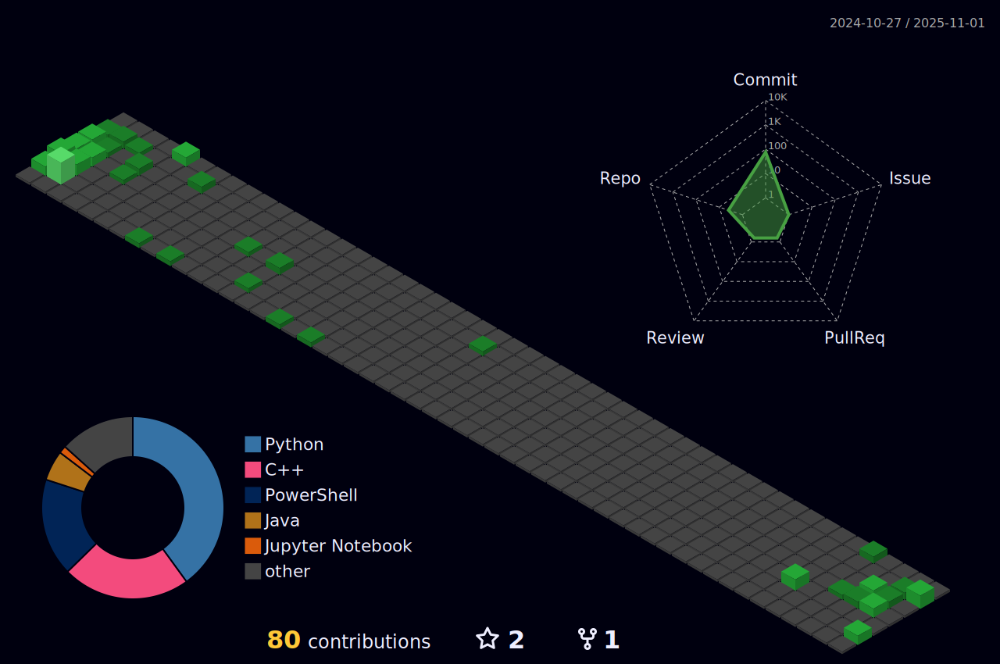

<!-- Original GIF for profile

   

-->

    
    

<h1>About Me! 🧠</h1>

My name is Henry Morgan (not to be confused with Captain Morgan 🏴‍☠️). I enjoy coding and learning to code in multiple areas of study in Computer Science.  I continue coding practice by using <a href="https://www.freecodecamp.org/">freeCodeCamp</a> and <a href="https://leetcode.com">LeetCode</a>! 💻

I am a motivated problem solver and strong communicator looking to prove how knowledgeable and value, and I look for opportunity to advance and expand my current skillset.  If I get the opportunity to do so, I'd also like to earn a Masters degree in Computer Science and/or Software Engineering.

<h2>Work 🕴️</h2>
<h3>Nylex.net, Inc.: September 2022 - Present</h3>

Currently, I work for <a href="https://www.nylex.net/">Nylex.net</a> as an Automation Technician.  My job is to work on projects for clients and the company using software engineering practices.  My most noteable project during this position is the Project/Promo Initiation (See Projects section for more info).

<h3>Little Caesars: August 2017 - December 2017</h3>

First job was making pizza pizza during my first semester in college.

<h2>Education 👨‍🎓</h2>
<h3>California State Polytechnic University, Humboldt (Cal Poly Humboldt): 2020 - 2022</h3>

I'm a Computer Science graduate with honors from California State Polytechnic University, Humboldt (formerly known as Humboldt State University).

I have been awarded the Computer Science Outstanding Student of the Year 2021-2022, from the Cal Poly Humboldt Department of Computer Science.

<h3>College of the Redwoods: 2017 - 2020</h3>

I attended College of the Redwoods to complete all the prerequisites I can take before transferring my way to a university.  In the process, I earned an associates degree in Liberal Arts: Science Exploration.

<h2>Projects 👨‍💻</h2>
<h3><a href="https://github.com/Nylex-net/PPI-Build2">Project/Promo Initiation (PPI)</a></h3>

One of the main reasons why I was hired at Nylex.net was because they needed help from someone to program an initiation system for the company SHN.  SHN is an engineering consultant company based in Eureka, California, and they needed an internal form to initiate new projects and promos by doing the following:

<ol>
  <li>Have the user enter PPI info into a multi-page web form.</li>
  <li>View their inputted information.</li>
  <li>Send to a server to manage the data.</li>
  <li>Insert the data into a Projects database to be used for searching, modifying, and updating information.</li>
  <li>Create the necessary directories within a shared drive to host project information.</li>
  <li>Apply Windows Protections to the folders that require it.</li>
  <li>Create a PDF to summarize all of the user's submitted information.</li>
  <li>Grab emails from admins and the selected individuals from the user's submission, and send them all a notice.</li>
</ol>

I created 5 different forms in total that follows the above scheme.  A few of the forms also include searching directories to find cooresponding project folders and files to manage.

Some of the tools I used for this project were Node.js, express, npm, JavaScript, HTML, Azure, and CSS.  Overall, this project ended up being very JavaScript heavy.  Over time, I continuously made improvements to the system based on the company's suggestions.  For every improvement I made, I'm glad about how well it turns out. The PPI is still currently in use today.  For security reasons, I'm keeping the original repository for this project private within Nylex's GitHub organization.  However, I'm currently working on an updated and improved version <a href="https://github.com/Nylex-net/PPI-Build2">here</a>.

<h3><a href="https://github.com/Nylex-net/website">Nylex.net's Company Website</a></h3>

To replace Nylex.net's current website, I was tasked to customize a new one to look more modern. But rather than using a CMS, web designer, or writing primarily in traditional website languages (i.e. HTML, CSS, and Javascript), I chose Python's Django framework. For me, the creation of this project was the most complex because of my choice of tools that all need to work together.  These tools include the following:

<ul>
  <li>Django (Python application framework)</li>
  <li>PostgreSQL</li>
  <li>Nginx</li>
  <li>Certbot</li>
  <li>Docker</li>
  <li>Kubernetes</li>
</ul>

My choice of approaching this project was to make the website an application that is editable through Django's built-in admin portal. Most of the web pages use the same consistent template for all of its web pages, and the individual page content is grabbed from the PostgreSQL database by using the slug name in the URL.  It uses Bootstrap 5.0 for the majority of its stylization and user interactions. Individual page content can be edited from the admin portal, and Django renders the template tags in the HTML files to fill the page content.

Next, I decided to introduce Docker containers to host the application. For this to work, I followed the example <a href="https://londonappdeveloper.com/deploying-django-with-docker-compose/">here</a>, which uses Docker Compose to create multiple containers. For this application to work, I needed a proxy server (Nginx) to help preload media and external files to render each page. I also created a certbot container for the website to use HTTPS.

Finally, I decided to introduce Kubernetes to learn how I can host these containers in an enterprise environment. The reason I wanted to use Kubernetes is to keep the website accessible during times of high web traffic and to manage software deployments.

You can find the repository for this project <a href="https://github.com/Nylex-net/website">here</a>.

<h3><a href="https://github.com/SeanFxyz/assembler_exemplar">Senior Capstone Project</a></h3>

For the senior capstone project, I grouped up with three fellow classmates to build a puzzle game about the basics of computer chips.  Our inspiration was from the classwork we'd done in our Computer Architecture class.  In that class, we used logic chips to build more complex chips using a selection of inputs and outputs.  The goal for each project in that class was to connect chips together in a way that every selection of inputs leads to the correct set of outputs.  Our game is called <strong>Assembler Exemplar</strong>. Our GitHub repository is located <a href="https://github.com/SeanFxyz/assembler_exemplar">here</a>.

<h3>Other Projects</h3>

Some more projects I'm proud of include the following:

<ul>
  <li>Portfolio.</li>
  <li>Recreated the typical operating system layers using C++.</li>
  <li>Using C# to interact with M-Files (a document management system) to build interactive objects.</li>
  <li>Built executable programs using Python.</li>
  <li>Wrote PowerShell scripts to manage the Windows operating system and devices.</li>
  <li>Custom built a database system for memes.</li>
  <li>Docker containers demonstrating examples of cybersecurity attacks written in the C language.</li>
  <li>A custom database built using <a href"https://www.airtable.com/">Airtable</a> for a local elderly support agency.</li>
</ul>
<h2>Programming Languages and Tools</h2>

  &nbsp;
  &nbsp;
  &nbsp;
  &nbsp;
  &nbsp;
  &nbsp;
  &nbsp;
  &nbsp;
  &nbsp;
  &nbsp;
  &nbsp;
  &nbsp;
  &nbsp;
  &nbsp;
  &nbsp;
  &nbsp;
  &nbsp;
  &nbsp;
  &nbsp;
  &nbsp;
  &nbsp;
  &nbsp;
  &nbsp;
  &nbsp;
  &nbsp;
  &nbsp;
  &nbsp;
  &nbsp;
  &nbsp;
  &nbsp;
  &nbsp;
  &nbsp;
  &nbsp;
  &nbsp;
  &nbsp;
  &nbsp;
  &nbsp;
  &nbsp;
  &nbsp;
  &nbsp;
  &nbsp;
  &nbsp;
  &nbsp;
  &nbsp;
  &nbsp;
  &nbsp;
  &nbsp;
  &nbsp;
  &nbsp;
  &nbsp;
  &nbsp;
  &nbsp;
  &nbsp;
  &nbsp;
  &nbsp;
  &nbsp;
  &nbsp;
  &nbsp;
  &nbsp;

<h2>Hobbies 🎮</h2>
<ul>
  <li>Play video games (My favorite series is The Legend of Zelda). 👾</li>
  <li>Take walks on my freetime.🚶‍♂️</li>
  <li>Traveling (both in real life and through Google Maps). 🗺️</li>
  <li>Watch various videos on YouTube. 🟥</li>
  <li>Watch Anime. 🗼</li>
  <li>Learn Japanese using Duolingo. 🎌</li>
  <li>Dank Memes. 🤤</li>
</ul>
<h2>Community Involvement 🌲</h2>
<ul>
  <li>Boy Scouts of America</li>
  <ul>
    <li>Highest Rank before leaving was Star Scout.</li>
    <li>Volunteer work for my local community.</li>
    <li>Exciting trips along the west coast.</li>
  </ul>
  <li>Clubs:</li>
  <ul>
    <li>Computer Science Club</li>
    <li>Key Club</li>
    <li>Drama Club</li>
  </ul>
</ul>
<!---
henatic/henatic is a ✨ special ✨ repository because its `README.md` (this file) appears on your GitHub profile.
You can click the Preview link to take a look at your changes.
--->
